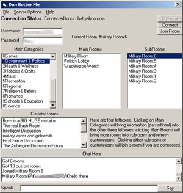



## Dun Botter Me \(Yahoo Chat Client\)

### Description

This is a combination of ingenuity and very hard work, working off of a few technical specs from loopy.org I built this chat client. His info was outdated, this is the latest, I must note that the night that I coded the Command Codes it was a 15 coffee night, nuff said. All you gotta do is go to chat.yahoo.com and sign up a username and password. This is a nifty little app and I am very proud that I have released this program, though it is as is.... I did do more with it but I can't release that as its intentions aren't exactly 'pure'... Anyways, let me know what you think, the code is pretty clean, not perfect as I haven't had time to clean it, too much other work/looking for a job, I live in Edmonton, Alberta, Canada

btw, thanks to planet-source for a kick-butt site. give me some globes!!

Its gonna be my last submission until the weekend, I need to find a job, want to employ me?

theprogrammer@telusplanet.net, or more info at pumkinhed.com
 
### More Info
 
All you need is a username so sign up at chat.yahoo.com

I assume that the user knows something. The EULA is as follows, if it don't work, kick it.

you to reality as soon as you realize how many features it lacks.

wacky visions of the future

             |
---                |---
**Submitted On**   |2001-04-25 15:27:16
**By**             |[Brandon Gabert](https://github.com/Planet-Source-Code/PSCIndex/blob/master/ByAuthor/brandon-gabert.md)
**Level**          |Advanced
**User Rating**    |5.0 (30 globes from 6 users)
**Compatibility**  |VB 5\.0, VB 6\.0
**Category**       |[Internet/ HTML](https://github.com/Planet-Source-Code/PSCIndex/blob/master/ByCategory/internet-html__1-34.md)
**World**          |[Visual Basic](https://github.com/Planet-Source-Code/PSCIndex/blob/master/ByWorld/visual-basic.md)
**Archive File**   |[Dun Botter188314252001\.zip](https://github.com/Planet-Source-Code/brandon-gabert-dun-botter-me-yahoo-chat-client__1-22702/archive/master.zip)

### API Declarations

It uses a couple of features I have included as other projects like linking to websites using labels, but its an excellent example of how to parse HTML, all you have to to do it go to the links embedded in the getRoomsList and getCustomRoomsList functions and take a look at their HTTP headers.

